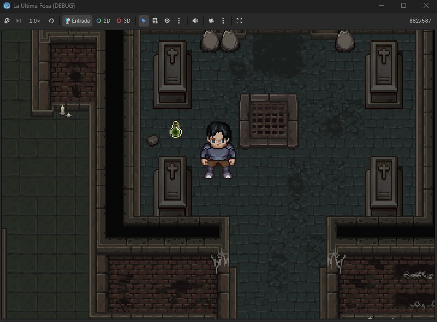
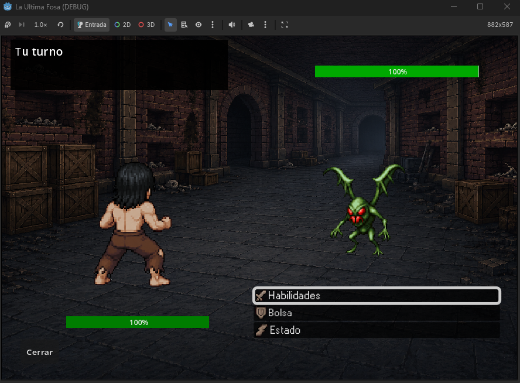

# La Última Fosa

## Descripción general

La Última Fosa es un videojuego de rol (RPG) en dos dimensiones, con perspectiva cenital y combate por turnos. Fue desarrollado con el motor Godot Engine 4.6 y el lenguaje GDScript. El proyecto se encuentra en estado de prototipo y se organiza bajo una arquitectura modular y extensible, orientada a facilitar la incorporación de nuevas mecánicas, niveles y elementos narrativos.

El jugador despierta sin memoria en las profundidades del Alto Bastión, una fortaleza derruida. A medida que asciende a través de catacumbas, túneles mineros y estancias abandonadas, deberá enfrentarse a enemigos corrompidos por la Estrigia, una plaga parasitaria que altera la mente y el cuerpo. La historia se revela de forma progresiva mediante inscripciones, documentos y diálogos dispersos por el mapa. El objetivo último es comprender qué desencadenó esta catástrofe y decidir el destino del protagonista frente a la Última Fosa, una fractura entre planos.

## Capturas de pantalla

## Características principales

- **Combate por turnos basado en velocidad**: el orden de las acciones se determina comparando la velocidad del jugador y la del enemigo. El valor exacto de la velocidad enemiga nunca se muestra, lo que obliga al jugador a deducirlo observando la secuencia de turnos.
- **Sistema de debilidades de enemigo**: cada criatura posee una debilidad física o mágica. El tipo de debilidad se revela únicamente después de que el jugador golpee al enemigo por primera vez. Atacar con el tipo correcto multiplica el daño.
- **Equipamiento y personalización de habilidades**: el jugador puede portar simultáneamente un arma (aporta ataque y hasta dos habilidades), una armadura (aporta defensa) y un sello mágico (aporta hasta dos habilidades, sin bonificación de estadísticas). No existen habilidades fijas; todas provienen del equipamiento.
- **Sistema de buffos y debuffos permanentes**: las habilidades pueden incrementar o reducir atributos (ataque, defensa, velocidad) de forma permanente durante todo el combate. Estos efectos son acumulables hasta un límite de dos aplicaciones por estadística.
- **Objetos consumibles de mejora temporal**: pociones y elixires que restauran puntos de salud o aumentan temporalmente una estadística durante un solo turno.
- **Menús navegables completamente por teclado**: el inventario, el equipo y los submenús de combate se controlan mediante las teclas WASD, E y Q, sin necesidad del ratón.
- **Transiciones entre niveles con efecto de fundido**: los cambios de zona se acompañan de una animación de pantalla negra y se conserva la posición y orientación del jugador.

## Controles

| Acción | Teclas |
|--------|--------|
| Movimiento del personaje | WASD o flechas direccionales |
| Correr (sprint) | Shift izquierdo |
| Interactuar o recoger | E |
| Abrir o cerrar el menú de personaje | I |
| Navegar por menús | WASD o flechas |
| Aceptar / Abrir | E |
| Cancelar / Salir | Q |

## Instalación y ejecución

Para compilarlo y ejecutarlo se necesita Godot Engine en su versión 4.6 o superior. Los pasos recomendados son:

1. Clonar el repositorio en una carpeta local.
2. Abrir Godot Engine y, desde el administrador de proyectos, seleccionar la opción de importar una escena o proyecto, apuntando a la carpeta que contiene el archivo project.godot.
3. Una vez cargado, ejecutar la escena principal playground.tscn o iniciar el proyecto directamente desde el editor.

No se requieren dependencias externas adicionales. El juego se ejecuta de forma nativa en Windows, Linux y macOS, aprovechando la compatibilidad multiplataforma de Godot.

## Estructura del proyecto

La organización de directorios respeta una separación clara de responsabilidades y facilita la escalabilidad. Los principales directorios son:

- **Combat**: contiene las escenas y scripts relacionados con la interfaz de combate, incluidos los submenús de habilidades, bolsa y estado.
- **Enemys**: almacena los recursos de estadísticas de los enemigos, sus scripts y los sprites específicos para el mundo y el combate.
- **Inventory**: gestiona todo el sistema de objetos: clases base (ItemResource, ConsumableItem, WeaponItem, ArmorItem, SealItem y SkillResource), recursos de ejemplo y subcarpetas por tipo (armas, armaduras, sellos, consumibles, habilidades).
- **Player**: contiene el nodo del jugador, su máquina de estados, animaciones y scripts de movimiento, interacción y cambio de sprites por equipamiento.
- **Scripts_Global**: agrupa los autoloads (singletons) como CameraManager, LevelManager, InventoryManager, EquipmentManager, PlayerStats, CombatManager y otros.
- **Shared_Assets**: reúne efectos visuales reutilizables (transición de fundido) y nodos de transición entre niveles (EntrancePoint, TransitionPoint).
- **UI**: alberga el menú del personaje (player_menu) y sus recursos gráficos.
- **WorldObjects**: define los objetos recolectables (CollectableItem) que aparecen en el mapa.
- **Zones**: contiene los niveles (catacombs_01, catacombs_02) con sus respectivos tilemaps, puntos de entrada, transiciones y enemigos.

## Estado actual del desarrollo

Hasta la fecha se han implementado los siguientes sistemas:

- Movimiento fluido del jugador con máquina de estados (Idle, Walk, WalkFast, Pickup).
- Gestión de mapas interconectados, transiciones entre ellos y límites de cámara.
- Recolección de objetos y almacenamiento en inventario.
- Sistema de estadísticas del jugador, equipamiento (arma, armadura, sello) y cálculo dinámico de atributos.
- Menú del personaje navegable por teclado, con opciones de usar, equipar, soltar y describir objetos.
- Cambio visual del personaje según la ropa y el arma equipadas en el mundo (capas superpuestas de sprites).
- Enemigos estáticos con detección de colisión y capacidad de iniciar combate.
- Combate por turnos aún en desarrollo, con menú principal (Habilidades, Bolsa, Estado), submenús de habilidades (cuadrícula de hasta cuatro habilidades), bolsa de consumibles (cuatro ranuras fijas) y estado (dos paneles informativos).
- Habilidades derivadas del equipamiento (armas y sellos), incluyendo buffos y debuffos acumulables.
- Consumibles de curación o mejora temporal de estadísticas (duración de un turno).

## Próximas funcionalidades

Se prevé la incorporación de los siguientes sistemas en versiones futuras:

- **Habilidades propias de enemigos**: cada criatura contará entre dos y cuatro habilidades (daño, mejora o debilitamiento) que ejecutará de forma autónoma durante su turno.
- **Sistema de documentos narrativos**: se añadirá una sección de lectura en el menú del personaje, donde se almacenarán y podrán consultarse todos los documentos, diarios y bitácoras encontrados.
- **Guardado y carga de partida**: se implementará persistencia completa del estado del mundo, inventario, equipamiento, progreso de NPCs y posición del jugador.
- **Menú principal**: pantalla inicial con opciones de nueva partida, cargar partida y salir del juego.
- **Puzzles ambientales**: mecanismos interactivos (palancas, plataformas móviles, acertijos de presión) que permiten desbloquear puertas, activar ascensores o revelar rutas secretas.
- **Eventos y cinemáticas en el mapa** (Opcional): disparadores que al activarse pausan el control del jugador, mueven la cámara, muestran diálogos o inician combates automáticos.

## Créditos

### Desarrollo y aprendizaje
- Tutoriales y referencias técnicas de la comunidad de Godot Engine, incluyendo canales como Michael Games, Pixies Game Dev y otros creadores de contenido sobre RPGs y combate por turnos.

### Recursos gráficos 
- **Colección Libre Pixel Cup**
- **Itch.io** – https://itch.io/game-assets
- **OpenGameArt** – https://opengameart.org

---

© 2025 PieroFCL. Proyecto de desarrollo personal. 
